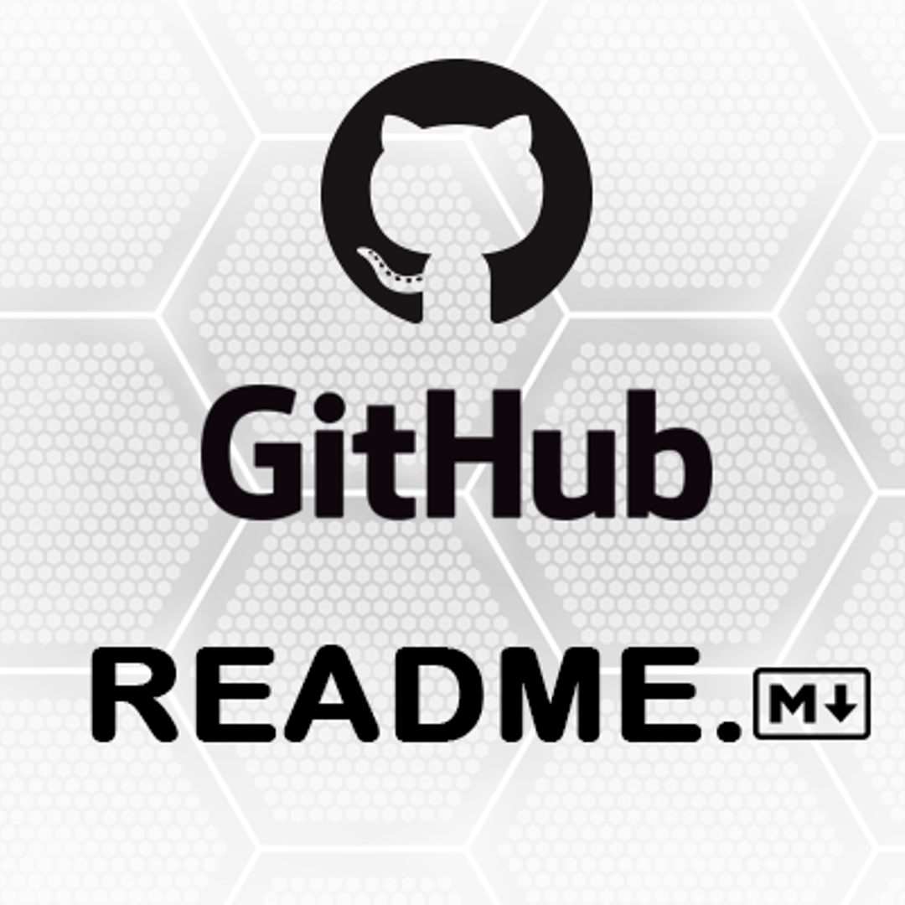

<!-- CTRL + K + C -->

<!-- Imagem usando Markdown -->
<!--   
-->

<!-- Imagem usando HTML -->

    

<!-- # Titulo MarkDown
### Titulo MarkDown
###### Titulo Markdown com menor fonte

<h1>Titulo HTML</h1>
<h6>Titulo HTML com menor fonte</h> -->

## Descrição do Projeto

Um bom README é a porta de entrada para o seu projeto
Seja para um projeto pessoal, acadêmico ou profissional, um README bem escrito é essencial para comunicar de forma clara e eficaz o que seu projeto faz, como usá-lo e como contribuir. Ele serve como um guia para qualquer pessoa que entre em contato com o seu trabalho, desde colegas de equipe até potenciais empregadores.

Invista tempo e atenção na criação do seu README
Um README completo e organizado demonstra profissionalismo e cuidado com o seu trabalho. Ele facilita a vida de quem precisa entender rapidamente o seu projeto, economizando tempo e evitando mal-entendidos. Além disso, um bom README pode atrair colaboradores e até mesmo ajudar a divulgar seu projeto para um público mais amplo.

## Tabela de conteúdos

<ul>
    <li><a href="#descricaoProjeto">Descrição do Projeto</a></li>
    <li><a href="#"> Status do Projeto</a></li>
</ul>

<!-- 

    <a href="#descricaoProjeto">Descrição do Projeto</a>
    ><a href="#"> Status do Projeto</a>
 
 -->
 

 ## Status do Projeto

 <h4 align="center">
    Em construção :rocket:
 </h4>